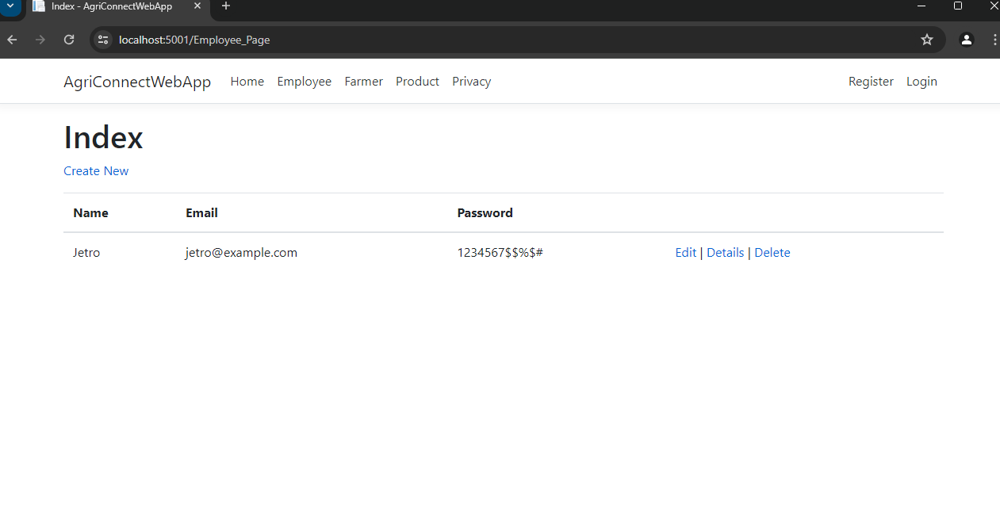
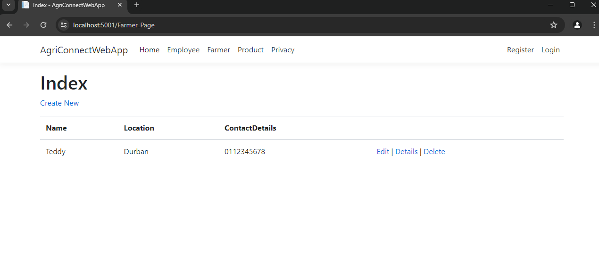
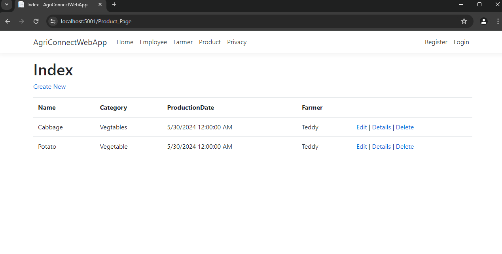

# Agri-Energy Connect Platform

The Agri-Energy Connect Platform is an innovative web application designed to facilitate the collaboration between farmers and energy experts to promote the adoption of renewable energy resources in the agricultural sector. This prototype demonstrates a functional model of the intended final product, showcasing essential features and functionalities.

## Screenshots

  

## Features

- **Database Development and Integration**: Manage information about farmers and their products.
- **User Roles and Authentication**: Secure login functionality with distinct roles for farmers and employees.
- **Farmer Features**: Add products with details like name, category, and production date.
- **Employee Features**: Add new farmer profiles, view and filter products.
- **User Interface Design**: User-friendly interface with responsive design for various devices.
- **Data Validation**: Maintain accuracy and consistency of data with validation checks.

## Technologies Used

- **ASP.NET Core 8.0**
- **Entity Framework Core**
- **Azure SQL Server**
- **ASP.NET Core Identity**

## Usage
The program should work out of the box after cloning and use the Azure DB through the connection string in `appsettings.json`.
When you run the project it should open your browser for you.

## Contributing
Contributions are welcome! Please fork this repository and submit pull requests with your proposed changes.

## License
This project is licensed under the MIT License. See the LICENSE file for details